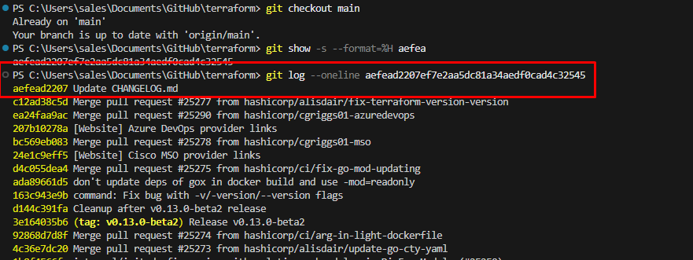
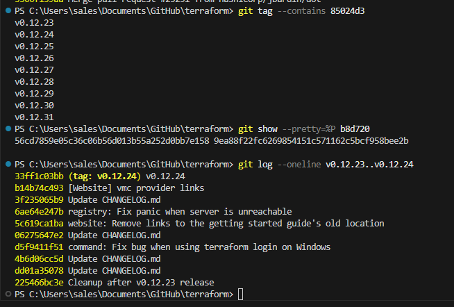
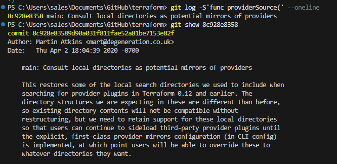
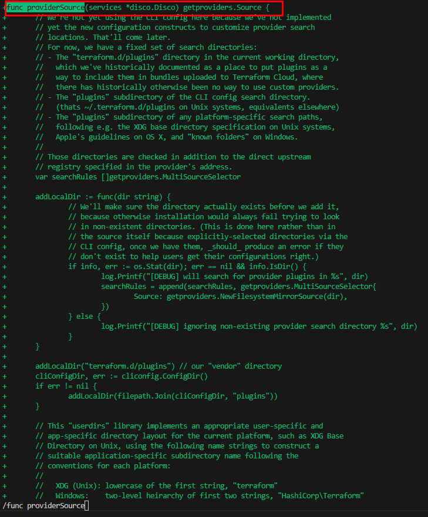
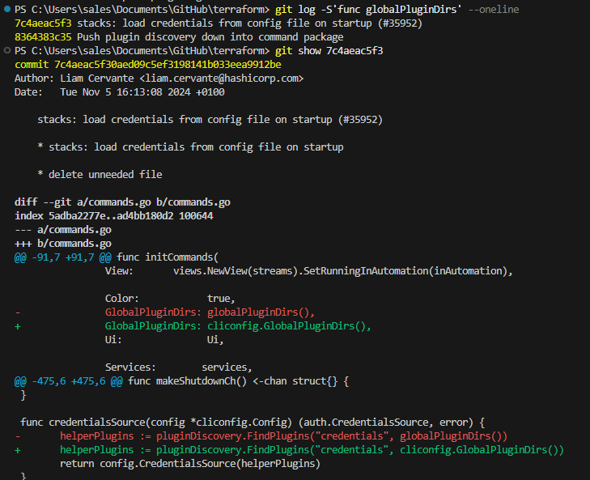
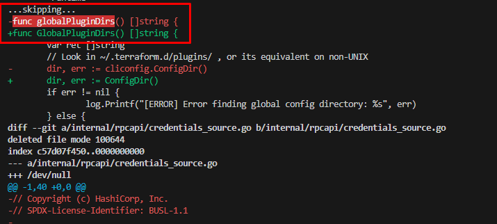
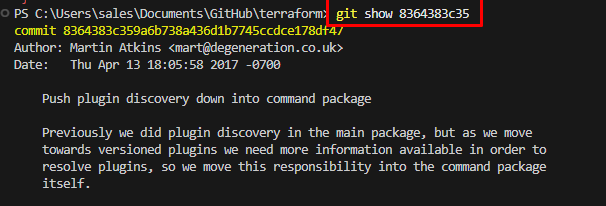
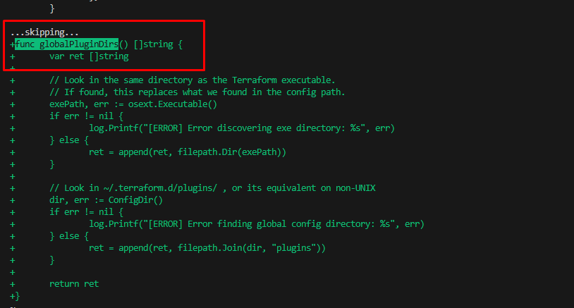
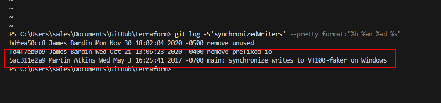

# Домашнее задание к занятию «Инструменты Git»

---

## Задание 1

##### Найдите полный хеш и комментарий коммита, хеш которого начинается на `aefea`.

**Команда:**
```bash
git log --oneline aefea
```

**Ответ:**
```
aefead2207f7e7e2aa5dc81a34aedfd0cad4c32545 Update CHANGELOG.md
```

----------------------


---

## Задание 2 ответы на вопросы:

##### Какому тегу соответствует коммит `85024d3`?

**Команда:**
```bash
git tag --contains 85024d3
```

**Ответ:**
```
v0.12.23
```

----------------------


---

##### Сколько родителей у коммита `b8d720`? Напишите их хеши.

**Команда:**
```bash
git show --pretty=%P b8d720
```

**Ответ:**
```
2 родителя:
56cd7859e05c36c06b56d013b55a252d0bb7e158  
9ea88f22fc6269854151c571162c5bcf958bee2b
```

----------------------


---

##### Перечислите хеши и комментарии всех коммитов, сделанных между тегами `v0.12.23` и `v0.12.24`.

**Команда:**
```bash
git log --oneline v0.12.23..v0.12.24
```

**Ответ:**
```
33ff1c03bb v0.12.24
b14b74c493 [Website] vmc provider links
3f235065b9 Update CHANGELOG.md
6ae64e247b registry: Fix panic when server is unreachable
5c619ca1ba website: Remove links to the getting started guide's old location
06275647e2 Update CHANGELOG.md
d5f9411f51 command: Fix bug when using terraform login on Windows
4b6d06cc5d Update CHANGELOG.md
dd01a35078 Update CHANGELOG.md
225466bc3e Cleanup after v0.12.23 release
```

----------------------


---

##### Найдите коммит, в котором была создана функция `func providerSource(...)`

**Команды:**
```bash
git log -S'func providerSource' --oneline
git show 8c928e8358
```

**Ответ:**
```
Хеш: 8c928e83589d040a31f811fae52a81b2f153e8ef  
Автор: Martin Atkins  
Комментарий: main: Consult local directories as potential mirrors of providers
```

----------------------

----------------------


---

##### Найдите все коммиты, в которых была изменена функция `globalPluginDirs`.

**Команды:**
```bash
git log -S'func globalPluginDirs' --oneline
git show 7c4aeeac5f3
git show 8364383c35
```

**Ответ:**
Функция изменялась в:
- `7c4aeeac5f3` — автор: Liam Cervante  
- `8364383c35` — автор: Martin Atkins

----------------------

----------------------

----------------------

----------------------


---

##### Кто автор функции `synchronizedWriters`?

**Команда:**
```bash
git log -S'synchronizedWriters' --pretty=format:"%h %an %ad %s"
```

**Ответ:**
```
5ac311e2a9 Martin Atkins Wed May 3 16:25:41 2017 -0700 main: synchronize writes to VT100-faker on Windows
```
